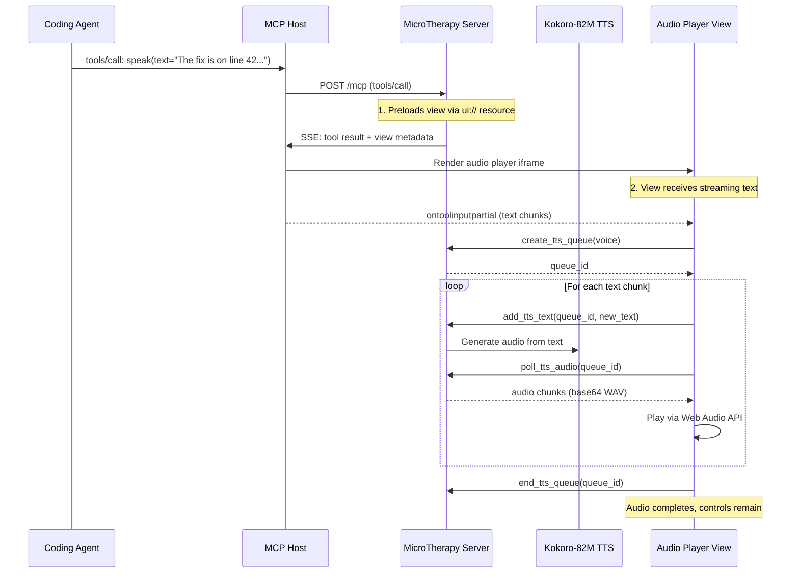

# PRD-00: MicroTherapy — Overview & Architecture

**Status:** Draft  
**Date:** 2026-07-25  
**Depends on:** None (this is the root PRD)  
**Read after:** PRD-01, PRD-02, PRD-03, PRD-04

---

## 1. Vision

**MicroTherapy** is an MCP 2.0 application that lets coding agents (like GitHub Copilot, Claude Code, etc.) **speak their answers aloud** to the user instead of requiring the user to read them. The user wants audible feedback — the agent "talks" through speakers/headphones.

The name "MicroTherapy" is a pun: it's therapeutic to hear your AI assistant speak to you, and it uses "micro" models (Kokoro-82M is only 82M params).

### User Story

> As a developer using an AI coding agent, when the agent finishes a task or has a question, I want it to speak its response aloud so I don't have to read the chat window.

---

## 2. Architecture Overview

```
┌──────────────────────────────────────────────────────┐
│                    MCP Host (VS Code / Claude)        │
│  ┌──────────────────────────────────────────────────┐ │
│  │              MCP App iframe (Audio Player)        │ │
│  │  ┌────────────┐  ┌──────────┐  ┌─────────────┐  │ │
│  │  │ Text Display│  │Play/Pause│  │Progress Bar │  │ │
│  │  └────────────┘  └──────────┘  └─────────────┘  │ │
│  │         ▲                │ postMessage            │ │
│  │         │ ontoolinput    │ tools/call             │ │
│  └─────────┼────────────────┼───────────────────────┘ │
└────────────┼────────────────┼────────────────────────┘
             │                │
    Streamable HTTP POST /mcp (JSON-RPC + SSE)
             │                │
┌────────────▼────────────────▼────────────────────────┐
│              MicroTherapy MCP Server (Python)         │
│                                                       │
│  ┌──────────────┐  ┌──────────────┐  ┌─────────────┐ │
│  │  speak tool  │  │ TTS Queue    │  │ UI Resource  │ │
│  │  (public)    │  │ Tools (app-  │  │ (ui:// view) │ │
│  │              │  │  only)       │  │              │ │
│  └──────┬───────┘  └──────┬───────┘  └─────────────┘ │
│         │                 │                           │
│  ┌──────▼─────────────────▼───────────────────────┐  │
│  │              Kokoro-82M TTS Engine              │  │
│  │  ┌──────────┐  ┌──────────┐  ┌──────────────┐  │  │
│  │  │Text→Audio│  │Streaming │  │Multi-Voice   │  │  │
│  │  │  82M     │  │ 80ms     │  │  28 voices   │  │  │
│  │  └──────────┘  └──────────┘  └──────────────┘  │  │
│  └────────────────────────────────────────────────┘  │
└──────────────────────────────────────────────────────┘
```

### Component Summary

| Component | Tech | Purpose |
|-----------|------|---------|
| MCP Server | Python (`mcp[cli]>=2.0.0b1` + `FastMCP`) | Exposes `speak` tool, serves UI resource, manages TTS queues |
| TTS Engine | Kokoro-82M (`kokoro>=0.9.4`) | Converts text to speech with multi-voice support |
| MCP App View | HTML + vanilla JS (embedded in Python) | Audio player UI rendered in host's sandboxed iframe |
| Transport | Streamable HTTP (`2026-07-28`) | Single POST `/mcp` endpoint, SSE for streaming |

---

## 3. Data Flow (Speaking a Response)



**Key insight:** The `speak` tool itself is mostly a trigger. The heavy lifting happens via private (app-only) tools that the View calls: `create_tts_queue`, `add_tts_text`, `poll_tts_audio`, `end_tts_queue`.

---

## 4. Streaming Strategy

Kokoro-82M supports full-audio generation:

| Mode | Input | Output | Use Case |
|------|-------|--------|----------|
| **Full audio** | Full text | Complete WAV (chunked at 80ms) | Agent has complete response |
| **Incremental** | Word-by-word text stream | Audio chunks as text grows | Agent is generating response token-by-token |

### Our Approach

We use a **queue-based polling** architecture (inspired by the say-server example):

1. Agent calls `speak(text="...")` — this might arrive all at once or in partial chunks via `ontoolinputpartial`
2. Server creates a TTS queue, returns `queue_id`
3. View incrementally sends new text to the queue as it arrives
4. Kokoro generates audio in parallel, appending chunks to the queue's output buffer
5. View polls for audio chunks and plays them via Web Audio API
6. When text is complete, View calls `end_tts_queue` to signal end-of-stream

### Why Polling (Not Pure SSE)?

- MCP 2.0 SSE streams are **request-scoped** — they close when the tool result is returned
- The View needs to receive audio **after** the tool call completes
- App-only tools give the View a clean RPC interface to the TTS backend
- This pattern is battle-tested by the official say-server example

---

## 5. Tech Stack

| Layer | Choice | Rationale |
|-------|--------|-----------|
| Language | Python ≥3.10 | Kokoro is Python; MCP Python SDK is mature |
| MCP SDK | `mcp[cli]>=2.0.0b1` | MCP 2.0 stateless server support |
| TTS | `kokoro>=0.9.4` | Local TTS, 82M params, 28 voices, 24kHz output |
| HTTP Server | `uvicorn` + `starlette` | ASGI, CORS middleware |
| App View | Vanilla JS (embedded in Python) | No build step, single-file executable |
| Audio Playback | Web Audio API | Sample-accurate scheduling, works in sandboxed iframe |
| Package Manager | `uv` / `hatchling` | Fast, modern Python tooling |

---

## 6. Project Structure

```
MicroTherapy/
├── AGENTS.md                  # Agent instructions (Telegram contact, etc.)
├── README.md
├── LICENSE
├── pyproject.toml             # Project metadata, dependencies, scripts
├── docs/
│   └── prd/
│       ├── PRD-00-overview.md       # ← this file
│       ├── PRD-02-mcp-server.md     # MCP 2.0 server implementation
│       ├── PRD-03-audio-player.md   # MCP App audio player UI
│       └── PRD-04-build-deploy.md   # Build, package, deploy
├── assets/
│   └── audio/
│       └── (generated audio files, gitignored)
└── src/
    └── microtherapy/
        ├── __init__.py
        ├── server.py          # Main MCP server entry point
        ├── tts.py             # Kokoro-82M TTS wrapper
        ├── queue.py           # TTS queue management
        └── view.py            # Embedded HTML view (audio player)
```

---

## 7. MCP 2.0 Compliance Checklist

- [x] Protocol version `2026-07-28` in `MCP-Protocol-Version` header and `_meta`
- [x] Stateless — no `initialize`/`initialized` handshake
- [x] Per-request `_meta` with `io.modelcontextprotocol/protocolVersion`, `clientInfo`, `clientCapabilities`
- [x] `server/discover` RPC for version advertisement
- [x] Streamable HTTP: single POST `/mcp` endpoint
- [x] SSE response streams for streaming responses where applicable
- [x] `Mcp-Method` and `Mcp-Name` headers on requests
- [x] MCP Apps: `ui://` resource URIs, `_meta.ui.resourceUri`, `text/html;profile=mcp-app`
- [x] `registerAppTool` / `registerAppResource` for View integration
- [x] App-only tools with `visibility: ["app"]`

---

## 8. PRD Sequence

Coding agents should implement these PRDs in order:

| # | PRD | What to Build | Est. Effort |
|---|-----|---------------|-------------|
| 0 | **Overview** (this) | Read for context | 5 min |
| 1 | **Kokoro TTS Integration** | `tts.py` — wrapping Kokoro-82M for streaming TTS | 2-4 hrs |
| 2 | **MCP 2.0 Server** | `server.py` — `speak` tool, queue tools, HTTP transport | 4-6 hrs |
| 3 | **Audio Player UI** | `view.py` — embedded HTML/JS audio player | 3-5 hrs |
| 4 | **Build & Deploy** | `pyproject.toml`, packaging, testing, Docker | 2-3 hrs |

**Total estimated effort:** 11-18 hours for a single developer.

---

## 9. Success Criteria

1. Agent can call `speak(text="Hello world")` and the user hears audio
2. Audio starts playing within ~200ms of text arriving (streaming)
3. The audio player shows text, play/pause button, and progress
4. Works in VS Code GitHub Copilot and Claude Desktop
5. Single-file executable: `uv run server.py --stdio` or `uv run server.py` for HTTP mode
6. Multiple voices available (28 Kokoro voices, American and British)
