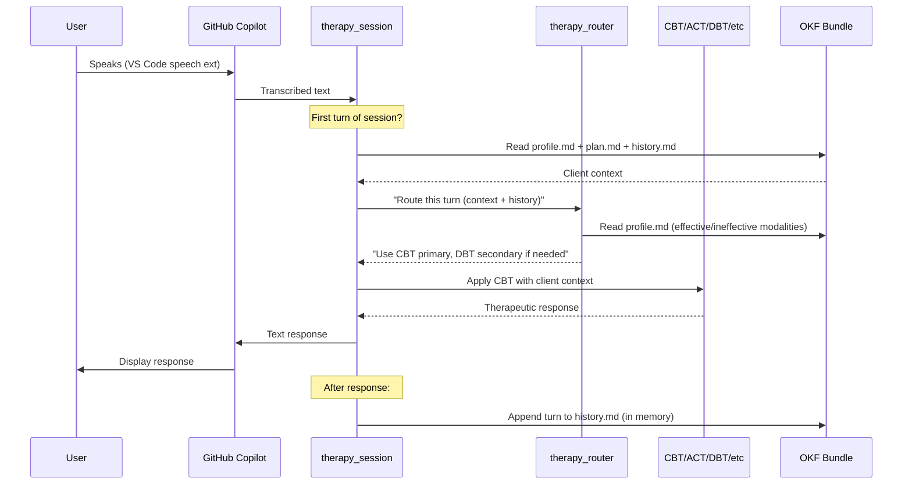

# PRD-10: MicroTherapy — AI Therapy System Architecture

**Status:** Implemented
**Date:** 2026-07-25
**Depends on:** PRD-00 (read for context)
**Read after:** PRD-11 (OKF structure), PRD-12 (router & orchestrator)

---

## 1. Vision

MicroTherapy is an AI therapy system that runs inside VS Code with GitHub Copilot.
The user speaks via the existing VS Code speech-to-text extension, and the AI
therapist responds in text (with MCP-based TTS audio output coming later).

Unlike a generic chatbot, MicroTherapy:

- **Remembers** — Client history, preferences, what worked and what didn't
- **Plans** — Maintains a prioritized treatment agenda across sessions
- **Adapts** — Chooses therapy modalities based on the issue AND the client's history
- **Uses multiple approaches** — Can layer CBT + DBT or switch when something isn't working
- **Feels human** — Starts sessions naturally ("How are you this week?"), follows the client's lead

All persistent state lives in **OKF (Open Knowledge Format)** bundles on disk.
There is no database, no server-side state — the files ARE the memory.

### User Story

> As a person working through personal issues, I want an AI therapist that
> remembers our conversations, picks up where we left off, adapts its approach
> to what works for me, and helps me make progress over time — not just a
> chatbot that treats every message like a fresh start.

---

## 2. Architecture Overview

```
┌──────────────────────────────────────────────────────────┐
│              VS Code + GitHub Copilot                     │
│                                                           │
│  User speaks (VS Code speech extension)                   │
│       ↓                                                   │
│  Copilot receives transcribed text                        │
│       ↓                                                   │
│  Agent instructions (.agent.md / SKILL.md) route to:      │
│       ↓                                                   │
│  ┌──────────────────────────────────────────────────┐    │
│  │         Therapy Session Orchestrator              │    │
│  │         (therapy_session skill)                   │    │
│  │                                                   │    │
│  │  1. Load client OKF bundle from disk              │    │
│  │  2. Open with General Therapy ("How are you?")    │    │
│  │  3. Each turn: hand off to Therapy Router         │    │
│  │  4. Detect non-responsiveness → signal router     │    │
│  │  5. Session end: write updated OKF files          │    │
│  └────────┬─────────────────────────────────────────┘    │
│           │                                               │
│  ┌────────▼─────────────────────────────────────────┐    │
│  │         Enhanced Therapy Router                    │    │
│  │         (therapy_router skill — UPDATED)           │    │
│  │                                                   │    │
│  │  • Reads client profile (effective/ineffective)   │    │
│  │  • Picks primary + optional secondary modality    │    │
│  │  • Detects non-responsiveness → suggests switch   │    │
│  │  • Records what was used and outcome              │    │
│  └────────┬─────────────────────────────────────────┘    │
│           │                                               │
│     ┌─────┴──────┬──────────┬──────────┬──────────┐      │
│     ↓            ↓          ↓          ↓          ↓      │
│  ┌──────┐  ┌──────┐  ┌──────┐  ┌──────┐  ┌──────────┐   │
│  │ CBT  │  │ ACT  │  │ DBT  │  │  MI  │  │  SFBT    │   │
│  │skill │  │skill │  │skill │  │skill │  │  skill   │   │
│  └──────┘  └──────┘  └──────┘  └──────┘  └──────────┘   │
│     ↓            ↓          ↓          ↓          ↓      │
│  ┌──────────────────────────────────────────────────┐    │
│  │  Crisis Response  │  General Therapy  │Assessment │    │
│  │  (highest priority)│  (rapport/transitions)       │    │
│  └──────────────────────────────────────────────────┘    │
│                                                           │
└──────────────────────┬───────────────────────────────────┘
                       │
                       ▼
┌──────────────────────────────────────────────────────────┐
│              OKF Knowledge Base (on disk)                  │
│                                                           │
│  knowledge/                                               │
│  ├── clients/{client-id}/                                 │
│  │   ├── index.md        ← Bundle index                   │
│  │   ├── profile.md      ← Who they are, history, prefs   │
│  │   ├── history.md      ← Running session log            │
│  │   ├── plan.md         ← Prioritized treatment plan     │
│  │   └── log.md          ← Change history                 │
│  ├── topics/                                              │
│  │   ├── index.md        ← Topic catalog                  │
│  │   ├── anxiety.md      ← What anxiety is, CBT questions │
│  │   ├── depression.md   ← Depression knowledge map       │
│  │   ├── shame.md        ← Religious shame, self-worth    │
│  │   └── ...                                              │
│  └── approaches/                                           │
│      ├── index.md        ← Modality catalog               │
│      ├── cbt.md          ← When CBT works, key techniques │
│      └── ...                                              │
└──────────────────────────────────────────────────────────┘
```

---

## 3. Component Summary

| Component | Type | Purpose |
|-----------|------|---------|
| `therapy_session` | Skill (NEW) | Orchestrates a therapy session: load→talk→route→save |
| `therapy_router` | Skill (UPDATED) | Multi-modality, history-aware routing |
| `assessment` | Skill (existing) | Pre-routing needs analysis |
| `cbt`, `act`, `dbt`, `mi`, `sfbt` | Skills (existing) | Specialist therapy modalities — NO CHANGES NEEDED |
| `crisis_response` | Skill (existing) | Highest-priority safety — NO CHANGES |
| `general_therapy` | Skill (existing) | Rapport, validation, transitions — NO CHANGES |
| `okf-open-knowledge-format` | Skill (existing) | OKF spec reference for reading/writing bundles |
| OKF Bundles | Data (NEW) | Client profiles, treatment plans, topic maps, session records |

### Design Principle: Skills Don't Hold State

Skills are stateless. They receive context (the conversation + OKF data) and
produce output (therapeutic responses + updated OKF content). The file system
holds the state between invocations.

---

## 4. Data Flow (One Therapy Turn)



At session end:

```
    Orchestrator->>Disk: Write updated history.md entry
    Orchestrator->>Disk: Update plan.md priorities/status
    Orchestrator->>Disk: Update profile.md if new patterns emerged
```

---

## 5. Session Lifecycle

### 5.1 Session Start

1. Orchestrator loads client OKF bundle (or creates one for new clients)
2. Reads `plan.md` for the prioritized agenda
3. Reads last `history.md` entry for continuity
4. Opens with General Therapy: "How are you doing this week?"

### 5.2 During Session (each turn)

1. User speaks → text arrives
2. Orchestrator appends to in-memory session transcript
3. Orchestrator calls router: "Given this turn + client history, what approach?"
4. Router returns modality recommendation
5. Orchestrator delegates to specialist skill
6. Specialist returns therapeutic response
7. Orchestrator returns response to Copilot
8. Orchestrator checks for non-responsiveness signals

### 5.3 Non-Responsiveness Detection

The orchestrator monitors for these signals across 3+ consecutive turns:

| Signal | Meaning | Action |
|--------|---------|--------|
| Short responses ("ok", "yeah", "I guess") | Disengagement | Ask if approach is working, suggest switch |
| Repeated "I don't know" | Stuck | Switch from insight-based to action-based (or vice versa) |
| Topic changes by client | Avoiding the issue | Note it, follow their lead, return later |
| Explicit resistance | Wrong approach | Switch modality immediately, log as ineffective |

### 5.4 Session End

1. Orchestrator summarizes key points
2. Writes session entry to `history.md`
3. Updates `plan.md`: priorities, status changes, new issues
4. Updates `profile.md` if new patterns/insights emerged
5. Suggests homework or reflection for next session

---

## 6. Modality Selection Flow

```
                    ┌─────────────────┐
                    │ Is there IMMEDIATE│
                    │   safety risk?    │
                    └──────┬──────────┘
                           │
              ┌────────────┼────────────┐
              │ Yes                     │ No
              ▼                         ▼
      ┌──────────────┐    ┌─────────────────────────┐
      │ CRISIS        │    │ Is this the FIRST turn   │
      │ RESPONSE      │    │ of the session?          │
      │ (override all)│    └──────────┬──────────────┘
      └──────────────┘               │
                          ┌──────────┼──────────┐
                          │ Yes                 │ No
                          ▼                     ▼
                  ┌──────────────┐    ┌─────────────────────┐
                  │ GENERAL       │    │ Check client HISTORY │
                  │ THERAPY       │    │ (profile.md):        │
                  │ (rapport)     │    │ - What worked before?│
                  └──────────────┘    │ - What didn't?       │
                                      │ - Client preferences │
                                      └──────────┬──────────┘
                                                 │
                                      ┌──────────▼──────────┐
                                      │ Match ISSUE + HISTORY│
                                      │ to BEST MODALITY     │
                                      │ + optional secondary │
                                      └──────────┬──────────┘
                                                 │
                                      ┌──────────▼──────────┐
                                      │ Apply for 3-5 turns  │
                                      │ Monitor engagement   │
                                      └──────────────────────┘
```

---

## 7. What We're NOT Building (Yet)

| Deferred | Why |
|----------|-----|
| MCP TTS audio output | Existing `speak` tool code exists; wire it up later |
| Multiple simultaneous clients | Single-user VS Code extension; file-based OKF handles one at a time |
| Database/persistence layer | OKF files on disk ARE the persistence |
| Web dashboard | VS Code is the UI |
| HIPAA compliance | This is a personal tool, not a medical device |
| Multi-language support | English only for MVP |

---

## 8. PRD Sequence

| # | PRD | What it Covers |
|---|-----|----------------|
| 10 | **Architecture** (this) | Read for context |
| 11 | **OKF Knowledge Structure** | All bundle layouts, schemas, field definitions |
| 12 | **Router & Orchestrator** | Enhanced therapy_router skill, new therapy_session skill |

---

## 9. Key Design Decisions

| Decision | Rationale |
|----------|-----------|
| OKF files = database | No server, no DB, no install. `cat` a file = read state. |
| Skills are stateless | Copilot invokes skills per-turn. State lives in files, not skills. |
| Specialist skills unchanged | CBT/ACT/DBT/MI/SFBT are pure clinical knowledge — they don't need to know about routing or state. |
| Router reads history | The router becomes the "learning" layer — it reads what worked before and adapts. |
| Orchestrator is thin | It delegates everything. Its only job is the load→talk→route→save loop. |
| Single-file per concept | OKF convention: one markdown file = one concept. Easy to read, write, and version. |
